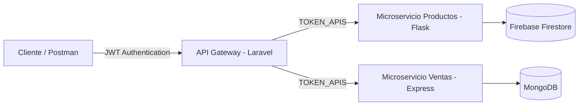
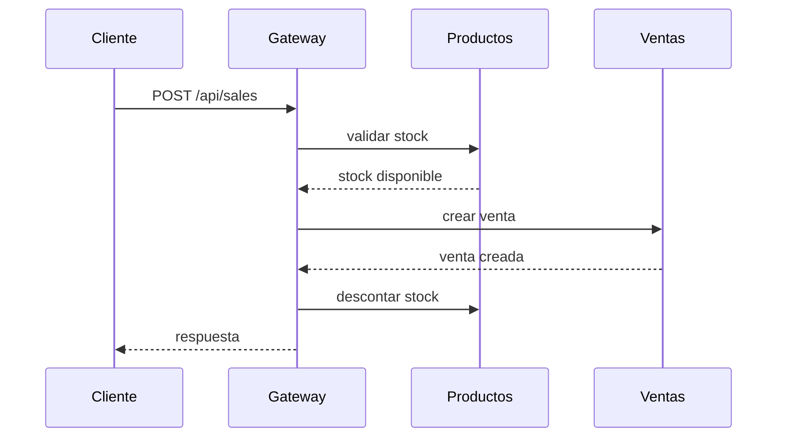

# Sistema de Ventas con Arquitectura de Microservicios

## Descripción

Este proyecto implementa un **sistema de ventas basado en arquitectura de microservicios**.

El sistema permite:

* gestionar productos
* validar stock
* registrar ventas
* consultar ventas por usuario

La aplicación está compuesta por múltiples servicios independientes que se comunican mediante **APIs REST**.

### Tecnologías utilizadas

* **API Gateway:** Laravel (PHP)
* **Microservicio de Productos:** Flask (Python) + Firebase Firestore
* **Microservicio de Ventas:** Express + MongoDB
* **Autenticación:** JWT
* **Comunicación entre microservicios:** HTTP REST con token compartido

---

# Arquitectura del Sistema

Cliente → API Gateway → Microservicios

Componentes del sistema:

### API Gateway (Laravel)

Responsabilidades:

* recibir las peticiones del cliente
* autenticación mediante **JWT**
* orquestar la comunicación entre microservicios
* enviar solicitudes a los servicios internos

### Microservicio de Productos (Flask)

Responsabilidades:

* gestión de productos
* validación de stock
* actualización de stock
* almacenamiento en **Firebase Firestore**

### Microservicio de Ventas (Express)

Responsabilidades:

* registro de ventas
* consultar ventas por usuario
* almacenamiento en **MongoDB**

---

# Seguridad

El sistema utiliza dos mecanismos de seguridad:

### 1. JWT para autenticación de usuarios

El **API Gateway** genera tokens JWT cuando un usuario inicia sesión.
Las rutas protegidas requieren enviar el token en el header:

```http
Authorization: Bearer TOKEN
```

---

### 2. Token compartido entre microservicios

Para evitar que cualquier cliente pueda consumir directamente los microservicios, se utiliza un **token interno**.

El API Gateway envía el siguiente header cuando realiza peticiones:

```http
Authorization: TOKEN_APIS
```

Este mismo token debe configurarse en los microservicios.

---

# Requisitos

Para ejecutar el proyecto es necesario tener instalado:

* PHP 8+
* Composer
* Node.js
* npm
* Python 3
* pip
* **MongoDB**
* **Firebase / Firestore**
* Postman o Thunder Client (opcional)

---

# Instalación del Proyecto

## 1. Clonar repositorio

```bash id="8cyrd0"
git clone <https://github.com/eidarragav/shop_project/tree/main>
cd shop_project
```

---

# API Gateway (Laravel)

## Instalación

Entrar al directorio:

```bash id="h9w0xt"
cd api_gateway_laravel
```

Instalar dependencias:

```bash id="c5caxg"
composer install
```

Crear archivo `.env`:

```bash id="8tt9kw"
cp .env.example .env
```

---

## Configuración del archivo `.env`

Editar `.env` y agregar:

```id="1t1vps"
TOKEN_APIS=token_microservicios

PRODUCTS_ENDPOINT = http://127.0.0.1:5000/api/products
CHECK_PRODUCT_STOCK_ENDPOINT = http://127.0.0.1:5000/api/products/validar_stock
UPDATE_PRODUCT_STOCK_ENDPOINT = http://127.0.0.1:5000/api/products/descontar_stock
SALES_ENDPOINT = http://127.0.0.1:3000/api/sales
MY_SALES_ENDPOINT = http://127.0.0.1:3000/api/my_sales


```

---

## Generar clave de Laravel

```bash id="xbpg72"
php artisan key:generate
```

Esto generará:

```id="mtjjzz"
APP_KEY
```

---

## Generar JWT Secret

El proyecto utiliza autenticación basada en **JWT**.

Ejecutar:

```bash id="47dc3p"
php artisan jwt:secret
```

Esto agregará al `.env`:

```id="7n7zh9"
JWT_SECRET
```

---

## Ejecutar API Gateway

```bash id="a4v52e"
php artisan serve
```

Disponible en:

```id="l2r26y"
http://127.0.0.1:8000
```

---

# Microservicio de Productos (Flask)

Este servicio gestiona productos y el stock utilizando **Firebase Firestore**.

## Arquitectura del sistema



## Instalación

Entrar al directorio:

```bash id="f4g6q6"
cd products_service_flask
```

Instalar dependencias:

```bash id="4knf9f"
pip install -r requirements.txt
```

---

## Configuración

Este microservicio requiere dos configuraciones:

### 1. Credenciales de Firebase

Ir a **Firebase Console → Project Settings → Service Accounts**
Generar una nueva clave privada y descargar el archivo JSON.

Renombrar el archivo como:

```id="mwy5ah"
serviceAccountKey.json
```

Colocarlo dentro del directorio del microservicio.

---

### 2. Archivo `.env`

Crear un archivo `.env` y agregar:

```id="c5tmsi"
PORT=5000
TOKEN_APIS=token_microservicios
```

El valor de **TOKEN_APIS** debe ser el mismo configurado en **Laravel**.

---

## Ejecutar servidor

```bash id="6puphu"
python app.py
```

Servidor disponible en:

```id="g3q4y9"
http://127.0.0.1:5000
```

---

# Microservicio de Ventas (Express)

Este servicio registra las ventas y utiliza **MongoDB**.

## Instalación

Entrar al directorio:

```bash id="p7izd5"
cd sales_service_express
```

Instalar dependencias:

```bash id="8ctb8h"
npm install
```

---

## Configuración de variables de entorno

Crear archivo `.env`:

```id="d0qs7s"
PORT=3000
DATABASE_URL=mongodb://localhost:27017/sales_db
TOKEN_APIS=token_microservicios
```

Variables:

* **PORT:** puerto del servidor
* **DATABASE_URL:** conexión a MongoDB
* **TOKEN_APIS:** token usado para validar peticiones desde el gateway

El valor de **TOKEN_APIS** debe ser el mismo que el configurado en Laravel.

---

## Ejecutar MongoDB

Antes de iniciar el servicio asegúrate de que MongoDB esté ejecutándose.

Ejemplo:

```bash id="glbe8y"
mongod
```

---

## Ejecutar servidor

```bash id="5ol3ga"
node server.js
```

Servidor disponible en:

```id="mccm1o"
http://127.0.0.1:3000
```

---

# Documentación de Endpoints (API Gateway)

El cliente debe interactuar **únicamente con el API Gateway (Laravel)**.
Los microservicios (**Flask - Productos** y **Express - Ventas**) no deben ser consumidos directamente por el cliente.

Todas las respuestas del Gateway tienen el siguiente formato:

```json
{
  "status": 200,
  "body": {}
}
```

* **status**: código HTTP devuelto por el microservicio.
* **body**: contenido de la respuesta del microservicio.


---
# Endpoints de Autenticación

## Registrar usuario

**POST**

```
/api/register
```

Body:

```json
{
 "name": "Usuario",
 "email": "usuario@email.com",
 "password": "123456"
}
```

Respuesta:

```json
{
   "message": "Usuario registrado"
}

```

---

## Login

**POST**

```
/api/login
```

Body:

```json
{
 "email": "usuario@email.com",
 "password": "123456"
}
```

Respuesta:

```json
{
   "token": "JWT_TOKEN"
}
```

Este token debe enviarse en todas las siguientes peticiones.

---

## Logout

**POST**

```
/api/logout
```

Header:

```http
Authorization: Bearer JWT_TOKEN
```

Respuesta:

```json
{
   "message": "Sesión cerrada"
}
```

---

# Endpoints de Productos

Los productos son gestionados por el **microservicio Flask** utilizando **Firebase Firestore**.

Modelo de producto:

| Campo    | Tipo    |
| -------- | ------- |
| name     | String  |
| category | String  |
| stock    | Integer |
| price    | Integer |

---

## Obtener productos

**GET**

```
/api/products
```

Header:

```http
Authorization: Bearer JWT_TOKEN
```

Respuesta:

```json
{
 "status": 200,
 "body": [
   {
     "id": "product_id",
     "name": "Producto",
     "price": 100,
     "stock": 10,
     "category": "categoria"
   }
 ]
}
```

---

## Crear producto

**POST**

```
/api/products
```

Header:

```http
Authorization: Bearer JWT_TOKEN
```

Body:

```json
{
 "name": "Producto",
 "price": 100,
 "stock": 10,
 "category": "categoria"
}
```

Respuesta:

```json
{
 "status": 201,
 "body": {
   "message": "Producto creado"
 }
}
```

---

## Actualizar producto

**PUT**

```
/api/products/{id}
```

Header:

```http
Authorization: Bearer JWT_TOKEN
```

Body:

```json
{
 "name": "Producto actualizado",
 "price": 120,
 "stock": 5,
 "category": "categoria"
}
```

Respuesta:

```json
{
 "status": 200,
 "body": {
   "message": "Producto actualizado"
 }
}
```

---

## Eliminar producto

**DELETE**

```
/api/products/{id}
```

Header:

```http
Authorization: Bearer JWT_TOKEN
```

Respuesta:

```json
{
 "status": 200,
 "body": {
   "message": "Producto eliminado"
 }
}
```

---

# Endpoints de Ventas

Las ventas son gestionadas por el **microservicio Express** utilizando **MongoDB**.

Modelo de venta:

| Campo      | Tipo    |
| ---------- | ------- |
| product_id | String  |
| quantity   | Integer |
| total      | Integer |
| user_id    | Integer |

El **user_id** se obtiene automáticamente desde el **JWT token** en el API Gateway.

---

## Obtener todas las ventas

**GET**

```
/api/sales
```

Header:

```http
Authorization: Bearer JWT_TOKEN
```

Respuesta:

```json
{
 "status": 200,
 "body": [
   {
     "_id": "sale_id",
     "product_id": "product_id",
     "quantity": 2,
     "total": 200,
     "user_id": 1
   }
 ]
}
```

---

## Crear venta

**POST**

```
/api/sales
```

Header:

```http
Authorization: Bearer JWT_TOKEN
```

Body:

```json
{
 "product_id": "PRODUCT_ID",
 "quantity": 2,
 "total": 200
}
```

### Flujo interno de creación de venta

Cuando se crea una venta el API Gateway realiza el siguiente proceso:

1. Consulta al microservicio de **productos** para verificar que el producto existe.
2. Valida que el producto tenga **stock disponible**.
3. Verifica que el stock sea suficiente para la cantidad solicitada.
4. Envía la solicitud al microservicio **Express** para registrar la venta.
5. Envía una solicitud al microservicio **Flask** para **descontar el stock** del producto.

Respuesta:

```json
{
 "status": 201,
 "body": {
   "message": "Venta creada"
 }
}
```

---

## Actualizar venta

**PUT**

```
/api/sales/{id}
```

Header:

```http
Authorization: Bearer JWT_TOKEN
```

Body:

```json
{
 "quantity": 3,
 "total": 300
}
```

Respuesta:

```json
{
 "status": 200,
 "body": {
   "message": "Venta actualizada"
 }
}
```

---

## Eliminar venta

**DELETE**

```
/api/sales/{id}
```

Header:

```http
Authorization: Bearer JWT_TOKEN
```

Respuesta:

```json
{
 "status": 200,
 "body": {
   "message": "Venta eliminada"
 }
}
```

---

## Obtener ventas del usuario autenticado

**POST**

```
/api/my_sales
```

Header:

```http
Authorization: Bearer JWT_TOKEN
```

Este endpoint obtiene únicamente las ventas del **usuario autenticado**.

El **user_id** se extrae desde el **token JWT** en el API Gateway y se envía al microservicio de ventas.

Respuesta:

```json
{
 "status": 200,
 "body": [
   {
     "_id": "sale_id",
     "product_id": "product_id",
     "quantity": 2,
     "total": 200,
     "user_id": 1
   }
 ]
}
```

---

# Pruebas de la API

Se recomienda utilizar:

* **Postman**
* **Thunder Client (VS Code)**

Ejemplo de petición:

```http
POST http://127.0.0.1:8000/api/sales
Authorization: Bearer JWT_TOKEN
```

Todas las peticiones deben realizarse **exclusivamente al API Gateway**, el cual se encarga de la comunicación con los microservicios.

---

## Flujo de creación de venta

